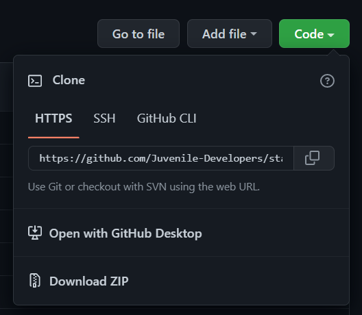

## Maintainers

Kishan Gurumurthy

Ram Samarth BB

# stayForever
We are in such a situation where time is consider as the elixer of life. Hence, we at "Juvenile Developers" came up with an intelligent solution.

The whole idea of "stayForever" is to save the time of the every individual. Thereby, increasing the productivity and can ultimately focus on their tasks.

## Badges
 

 

## Features

It is a web browser extension solely developed for Windows/MacOS/Linux. 

The product is tested on multiple platforms like Google Chrome, Microsoft edge, Opera and other web browsers. 

## Extension Logo

## Installation

1. Download the zip file from the github.

  

2. Then open the web browser of your choice, then head on to the extensions, and then toggle between the developer mode button and make sure that it is turned on. 
  
  

  

## License 

stayForever is distributed under the Apache 2.0 license
